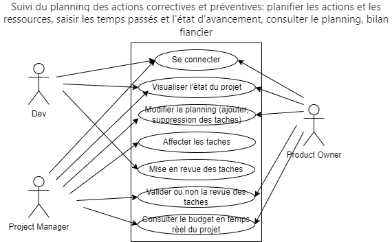

= CCT Gr3

guillaume Benhamou / Lucas Brana / Matthieu Barut

== Subject

The subject that we have chosen is a *Project Manager* based on differents model:
- Monday
- Trello
- Asana
- Jira

== Personnas

=== Personna 1
Name: John
Age: 35
Job: Project Manager
Background: John is a project manager in a company that develops software. He has a team of 10 people and he is responsible for the development of a new software. He has to manage the team, the tasks and the deadlines. He is looking for a tool that will help him to manage his project.

=== Personna 2
Name: Alice
Age: 25
Job: Developer
Background: Alice is a developer in a company that develops software. She is part of a team of 10 people and she is responsible for the development of a new software. She has to work on different tasks and she has to respect the deadlines. She is looking for a tool that will help her to manage her tasks.

=== Personna 3
Name: Bob
Age: 30
Job: Product Owner
Background: Bob is a product owner in a company that develops software. He is responsible for the development of a new software. He has to manage the team, the tasks and the deadlines. He is looking for a tool that will help him to manage his project.

== User Story

=== User Story 1
As a project manager, I want to be able to create a new project, so that I can manage my project via common tools as GANTT chart, Kanban board, etc.

=== User Story 2
As a Developer, I want to be able to create a new task, so that I can manage my tasks via common tools as GANTT chart, Kanban board, etc.

=== User Story 3
As a Product Owner, I want to be able to create a new task, so that I can manage my tasks via common tools as GANTT chart, Kanban board, etc.

== Diagram Use Case

.Use Case Diagram

== CTT
.CCT

== Architecture

=== Frontend

- Connection Page

- Home Page

- Project set Page

=== Backend

==== SQL Database

- Project Table
    - Project ID
    - Project Name
    - Project Description
    - Project Start Date
    - Project End Date
    - Users List
    - Tasks List

- User Table
    - User ID
    - User Name
    - User Email
    - User Password
    - User Role

- Task Table
    - Task ID
    - Task Name
    - Task Description
    - Task Start Date
    - Task End Date
    - Task Status
    - Task User

