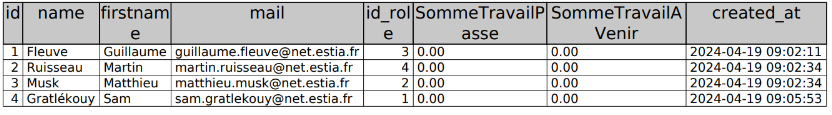
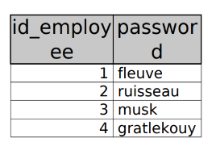
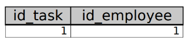

= Database

== Image de l'architercture de la base de données

.Schéma de la base de données

=== Employé
Cette table contient les informations des employés de l'entreprise.

=== Rôles
Cette table definit les rôles des employés et leur taut horaire.

=== Security
Cette table contient les informations de connexion des employés et permet d'isoler les informations sensibles.

=== Tasks
Cette table contient les informations des tâches à réaliser et réalisées.

=== AssignedTasks
Cette table est la table de liaison entre les employés et les tâches qui leur sont assignées.

=== States (of tasks)
Cette table contient les différents états des tâches.

=== Type (of tasks)

Cette table contient les différents types de tâches.

